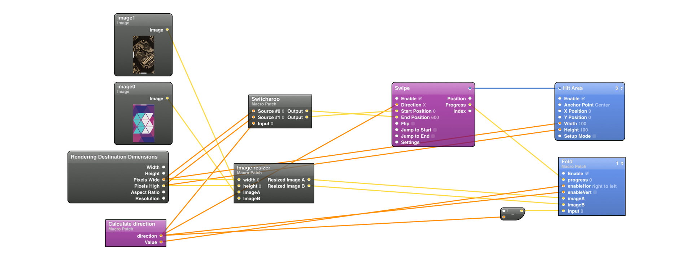
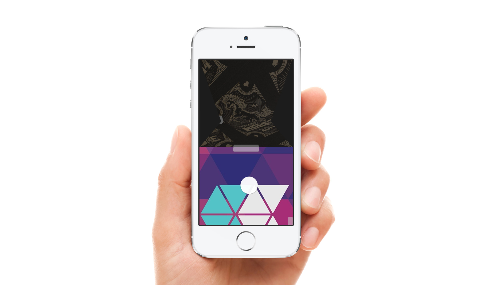
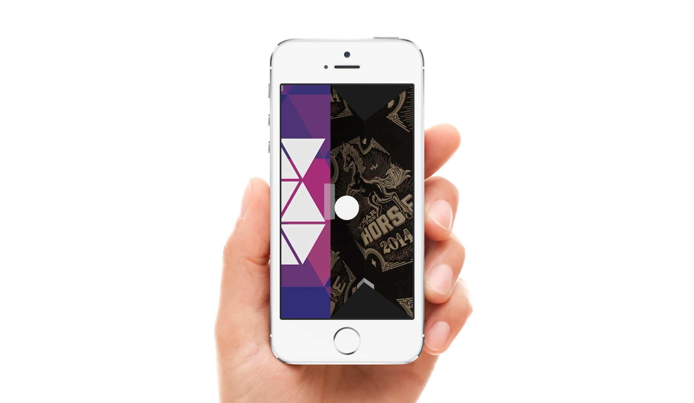

# Origami-Transitions
Origami transitions for Quartz Composer
===========

Responsive mobile UI/image transitions for the prototyping tool Origami (by Facebook)

For more examples of Facebook's Origami and Quartz Composer visit my porfolio at www.justaddmusicmedia.com

Enjoy responsibly and build something awesome! (please email me and let me know how you used it, it would be good to see)

Video Preview 
https://vimeo.com/124319366

## Features
- Transition between two images
- Origami Live support
- Responsive
- Swipe Direction locking

## How to Use
- Clone this repo
- Open the **.qtz files**
- Have fun!

## Dependencies
Requires [Quartz Composer](http://adcdownload.apple.com/Developer_Tools/graphics_tools_for_xcode__xcode_6.1/graphicstools_for_xcode_6.1.dmg "Quartz Composer") and [Origami](http://facebook.github.io/origami/download/ "Origami") 

## Known Issues

